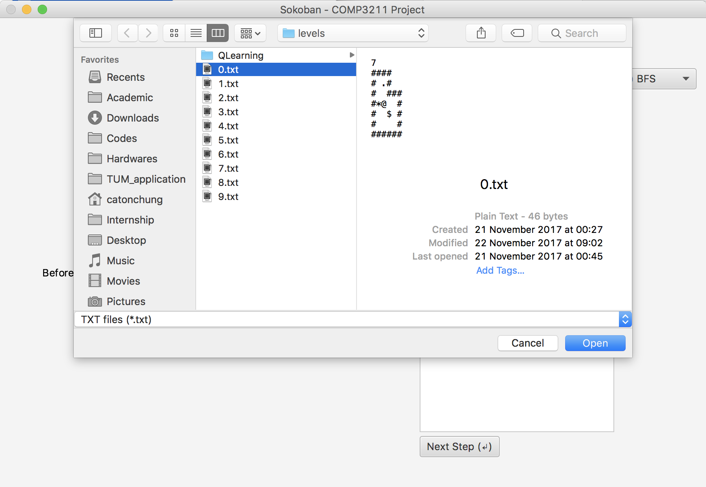
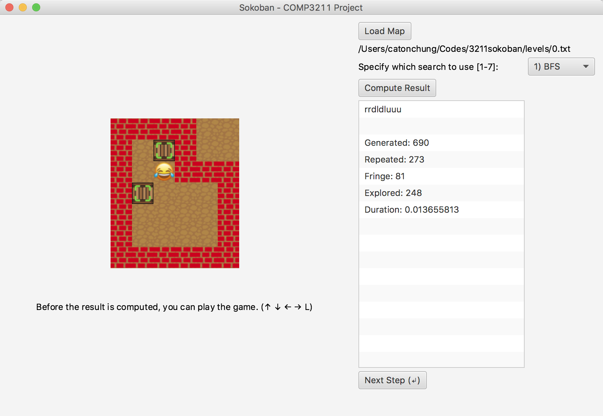

# Sokoban AI Solver (HKUST COMP3211 Project)
## group member
| Name         	| Student ID   	| 
| ------------- 	|:-------------:	|
| GAO, Huaxuan  	|  20328408     	|
| HUANG, Xuhua  	|  20329347     	|
| LIU, Shuyue   	|  20329256     	|
| WANG, Guanzhi 	|  20329604		|
| ZHONG, Zixuan	|  20328800		|

## use

### 1) clone this project

```bash
$ git clone https://github.com/zzhongab/AI_Sokoban.git
```
### 2) launch the GUI

```bash
$ cd AI_Sokoban/bin
$ java GUI 
```

### 3) load a game map



Before the result is computed, you can play the game. (↑ ↓ ← → L)

### 4) compute the result


### 5) make the agent move according to the result




## credit

[wfalkwallace/AI/tree/master/hw2](https://github.com/wfalkwallace/AI/tree/master/hw2)
